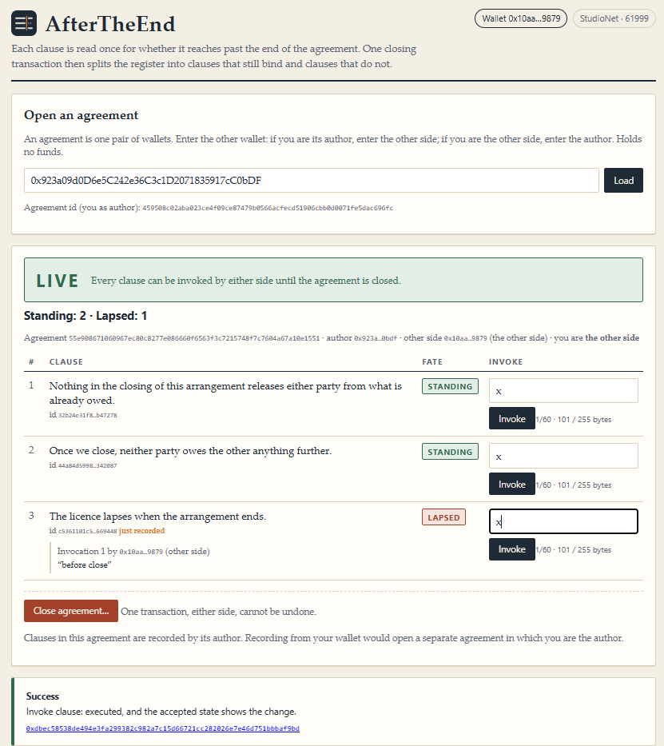
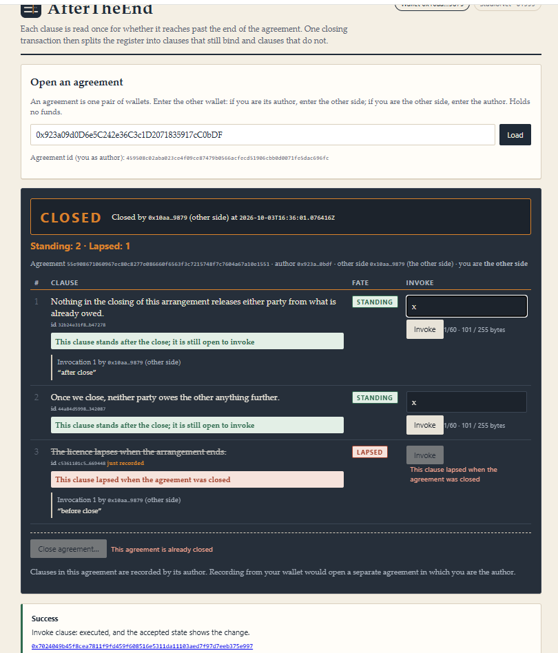

AfterTheEnd does not ask whether a clause is valid, and it does not check a clause against a policy. Every clause here is live and invocable. It asks one thing: when the two sides close the agreement, does this clause reach past that moment or stop at it — and it lets a single closing transaction split the whole register along that line.

 

# AfterTheEnd

A dApp on GenLayer StudioNet (chain 61999) built on the `SurvivalGate` Intelligent Contract
(`contracts/SurvivalGate.py`, py-genlayer v0.2).

| | |
|---|---|
| Live app | https://after-the-end-chi.vercel.app |
| Contract (this Project's own deployment) | [`0x4fE214a0a79888c3bA8639976Ec4Ed4b08861B2A`](https://explorer-studio.genlayer.com/address/0x4fE214a0a79888c3bA8639976Ec4Ed4b08861B2A) |
| Source | frozen; SHA-256 in `SOURCE_SHA256.txt`, checked in CI |
| Contract submission | SurvivalGate — [github.com/quyenvu13/SurvivalGate](https://github.com/quyenvu13/SurvivalGate) (separate address) |

- Each clause is read **once** by the validators: `SURVIVES` (still holds after the close) or
  `DIES_WITH_IT` (stops at the close). The label is frozen as a fate, `STANDING` or `LAPSED`.
- Until the agreement is closed, **every clause behaves the same**: either side can invoke any clause.
- `close_agreement` is one deterministic transaction, callable by either side, with no model call.
  After it, `STANDING` clauses stay invocable and `LAPSED` clauses revert with
  *"This clause lapsed when the agreement was closed"* — for good.
- No clause can be added after the close, so nobody can wait for the event and then write the clause
  that would have paid off.

**The contract holds no funds.** It moves no money, enforces nothing off-chain and is not an escrow.
Some example clauses mention what is owed; the contract only records which clauses can still be invoked.

## How to try it

You need **two wallets** of your own (an agreement is exactly one pair of wallets, so a shared demo
agreement would not work for you). Use your own, not anyone else's.

1. Open the app, connect MetaMask (it switches to StudioNet; no Snap is needed).
2. Wallet A: enter wallet B as the other party, set a label (for example `the other side`), and record
   **at least two clauses** — one you expect to outlive the agreement and one you expect to end with it.
   The model's label appears in the table as `STANDING` or `LAPSED`.
3. Wallet B: load the agreement by entering wallet A, and invoke both clauses. Both work.
4. Either wallet: **Close agreement…** — the dialog lists exactly the clauses that will lapse and asks you
   to type `CLOSE`. **This cannot be undone.**
5. After the close the banner turns `CLOSED`; the `STANDING` row still has an active `Invoke` button,
   the `LAPSED` row's button is disabled with the contract's own revert sentence, and invocations made
   before the close are still listed.

Clause text and label may not contain the words `SURVIVES` or `DIES_WITH_IT` in any letter case (they are the
model's answer tokens), so write "continues after", "outlasts", "stops at" instead of "survives".

The UI never sends a transaction it already knows will revert; the button is disabled and shows the
contract's exact sentence instead. Notes are limited to 60 characters and clause text to what fits in
255 bytes of calldata (about 160 characters, see the live meter).

## Honest limitation

1. **The contract holds no money and enforces nothing off-chain.** It only decides which clauses can
   still be invoked after the agreement closes, and keeps every invocation next to its contest.
2. **An invocation is a self-declared statement.** Nobody proves that what was invoked is true. The
   value is that a clause's fate is frozen **before** the event, so neither side can pick a fate after
   seeing what it would cost.
3. **A wrong `DIES_WITH_IT` is the main risk, and it cannot be repaired.** A clause wrongly labelled
   `LAPSED` stops being invocable at the first `close_agreement`, and no method restores it. Safety
   nets: unclear or unparseable model output is treated as `SURVIVES`; the close dialog lists every
   clause about to lapse, by text, and requires typing `CLOSE`; `contest_invocation` keeps working
   after the close.
4. **A wrong `SURVIVES` keeps the author bound longer than intended.** The cost falls on whoever wrote
   the unclear sentence, and the two sides can still settle it off-chain. This is deliberate.
5. **Either side can close alone.** That is the "either party may terminate" model, not every real
   contract. There is no two-signature close, and the contract does not check whether the closing
   side had the right to close under any off-chain law.
6. **`MAX_CLAUSES_PER_AGREEMENT` (20) and `MAX_INVOCATIONS` (20 per clause) are hard caps.** A full
   agreement stays `LIVE` but accepts no new clause; it does not close itself. Because one pair of
   wallets has exactly one agreement, the same two wallets cannot open a second one. If both wallets
   each author an agreement naming the other, `close_agreement` from a wallet always closes the one that
   wallet authored; the app likewise shows the agreement you authored first.

Also: the contract caps clause text at 600 characters, but only texts up to about 160 characters fit the
255-byte calldata path that has been measured; longer texts are blocked in the UI and are **not proven**
on StudioNet.

## Repository

| Path | What |
|---|---|
| `contracts/SurvivalGate.py` | the contract (frozen; SHA-256 in `SOURCE_SHA256.txt`) |
| `LOCKED_SPEC.md` | the design that must not change |
| `TEST_PLAN.md` / `TESTING.md` | cases, what is automated, what was run by hand, what is not proven |
| `RUNTIME_EVIDENCE.md` | StudioNet transactions, one hash per row |
| `tests/contract/` | Direct Mode tests on the real py-genlayer SDK (model mocked) |
| `tests/js/` | frontend logic tests (Python parity, ids, revert mirroring, receipts, postconditions) |
| `tools/` | calldata size table, RPC calldata probe, source hash check, `tools/ids.html` (offline id calculator for calling the contract from Studio) |
| `SURVIVALGATE_KILLSET_CHECK.py` | gate: no token separates the test classes; rubric shares no word with them |

Run locally: `npm ci && npm run build && npm test && npm run verify:source`, and
`python3 -m pytest tests/contract -q` (Python 3.12+, `genlayer-test==0.29.2`).

Deployment: the app talks to the address in `src/lib/config.ts` (also listed in `deployments.json`);
`VITE_CONTRACT_ADDRESS` overrides it for a fork.

License: MIT.
